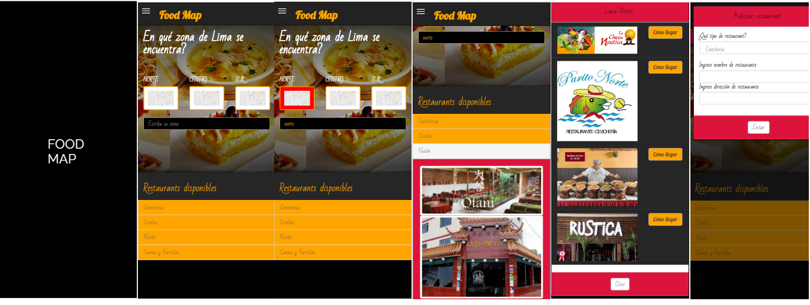

## FOOD MAP
En el siguiente proyecto se mostrará la página web en versión desktop y movil.
Food Map es un sitio web en el cual es usuario podra ubicar diferentes tipo de restaurantes según la zona en la que se encuetre.
### Herramientas  
Se hizo uso del framework Bootstrap y la galería de Jquery además de :
- JavaScript
- CSS
- HTML
- GoogleFonts
- Expresión regular
- Marvel app
### Producto Final
 Vistas

